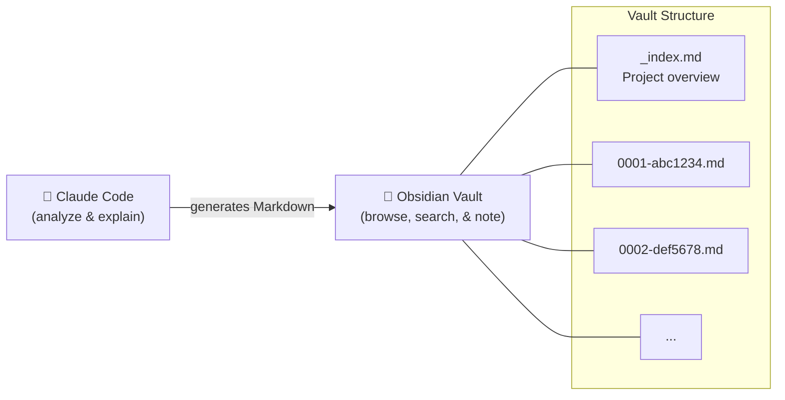

# Deep Code Reader

**Learn OSS codebases commit by commit — build an Obsidian knowledge base with AI-powered explanations**

A conversational Claude Code skill for systematic deep code reading. Analyze commits chronologically, understand how open source projects evolved, and automatically generate rich Markdown documentation into your Obsidian vault.

## Why Obsidian?

Deep Code Reader doesn't just explain code — it **builds a searchable knowledge base** in your Obsidian vault. Every commit analysis is saved as a Markdown file with Mermaid diagrams, design pattern breakdowns, and your own Q&A. Over time, you accumulate a structured library of architectural knowledge that you can browse, search, and annotate.



## Quick Start

```
/deep-code-reader

📚 Deep Code Reader
━━━━━━━━━━━━━━━━━━━━━━━━━━━━━━

What would you like to read?

> I want to read express

✅ Set up expressjs/express
📊 Total commits: 5,432

Start from the first commit?

> Yes

[Detailed analysis is displayed and saved to Obsidian]

> Why is this pattern used here?

[Answers your question, saves Q&A to the Markdown file]

> Next

[Next commit analysis...]
```

## Features

- **Conversational interface** — No commands to memorize; just talk naturally
- **Rich analysis output** — Mermaid diagrams, design patterns, Before/After comparisons
- **PR context included** — Discussion threads and review comments, translated and explained
- **Q&A accumulation** — Your questions and answers are auto-saved to each commit's file
- **Obsidian knowledge base** — All output is structured Markdown, ready to browse, search, and annotate

## What You Can Say

| Intent | Examples |
|--------|---------|
| Start | "I want to read express", "analyze react" |
| Next commit | "next", "continue" |
| Ask questions | "Why is this pattern used?", "What does this do?" |
| View list | "commit list", "list" |
| Check progress | "progress", "status" |
| Read specific | "explain abc1234", "read PR #298" |

## What Each Analysis Contains

Every commit generates a Markdown file with:

- 📋 **Basic info** — PR number, author, change size
- 🎯 **Change summary** — Core concept, Before/After
- 🏗️ **Architecture** — Visualized with Mermaid diagrams
- 💻 **Code walkthrough** — With design rationale
- 💬 **PR discussions** — Original English + Japanese translation + context
- 🎓 **Design patterns** — Patterns and principles applied
- 🔄 **Before/After** — Comparison of improvements
- 📚 **Learning points** — Key takeaways from this commit

## Output Structure

```
~/obsidian-vault/deep-code-reading/
└── expressjs-express/
    ├── _index.md              # Project overview
    └── commits/
        ├── 0001-abc1234.md    # Each commit analysis
        ├── 0002-def5678.md
        └── ...
```

## Requirements

- Claude Code CLI
- Git
- GitHub MCP server (for PR information)
- Obsidian (recommended) or any Markdown editor

## Installation

### Via Plugin Marketplace (Recommended)

1. Open **Manage Plugins** (Claude Code settings)
2. Go to the **Marketplaces** tab
3. Enter `Kuroakira/deep-code-reader` and click **Add**
4. Switch to the **Plugins** tab and install `deep-code-reader`

To update or uninstall, use the same **Plugins** tab.

### Manual Installation

```bash
git clone https://github.com/Kuroakira/deep-code-reader.git
cd deep-code-reader
mkdir -p ~/.claude/skills
ln -s $(pwd) ~/.claude/skills/deep-code-reader

# To uninstall:
rm ~/.claude/skills/deep-code-reader
```

## Configuration

Default paths:
- Repos: `~/.claude/deep-code-reader/repos/`
- Projects: `~/.claude/deep-code-reader/projects/`
- Vault: `~/obsidian-vault/deep-code-reading/`

## License

MIT
