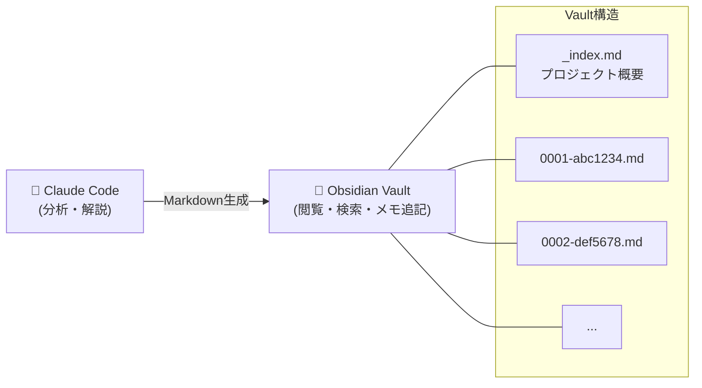

# Deep Code Reader

**OSSコードベースをコミットごとに学び、Obsidianにナレッジベースを自動構築**

会話型のClaude Codeスキルによる体系的なディープコードリーディング。コミットを時系列で分析し、AI が生成したリッチなMarkdownドキュメント（Mermaid図・設計パターン解説・Q&A付き）をObsidian vaultに蓄積。読めば読むほど、検索・閲覧可能なアーキテクチャ知識ライブラリが育つ。

## クイックスタート

```
/deep-code-reader

📚 Deep Code Reader
━━━━━━━━━━━━━━━━━━━━━━━━━━━━━━

何を読みますか？

> expressを読みたい

✅ expressjs/express を設定しました
📊 総コミット数: 5,432

最初のコミットから読み始めますか？

> はい

[詳細な解説が表示される]

> なぜこのパターンを使ってるの？

[質問に回答、Q&Aに保存]

> 次

[次のコミット解説...]
```

## 特徴

- **会話型インターフェース** - コマンドを覚える必要なし
- **詳細な解説** - Mermaid図、設計パターン、Before/After比較
- **PR情報統合** - ディスカッション、レビューコメントも翻訳・解説
- **Q&A蓄積** - 質問と回答を自動保存
- **Obsidian連携** - ナレッジベースとして蓄積・検索

## なぜObsidian？

Deep Code Reader は単にコードを解説するだけでなく、**検索可能なナレッジベースをObsidian vaultに構築** します。コミット解説はすべてMermaid図・設計パターン分析・Q&A付きのMarkdownとして保存。読み進めるほど、閲覧・検索・注釈可能なアーキテクチャ知識ライブラリが蓄積されます。



## 話し方

| やりたいこと | 言い方の例 |
|------------|-----------|
| 始める | 「expressを読みたい」「reactを分析」 |
| 次へ進む | 「次」「続き」 |
| 質問する | 「なぜこうなってる？」「このパターンは？」 |
| 一覧を見る | 「コミット一覧」「リスト」 |
| 進捗確認 | 「進捗」「どこまで読んだ？」 |
| 特定のを読む | 「abc1234を解説して」「PR #298を読む」 |

## 出力構造

```
~/obsidian-vault/deep-code-reading/
└── expressjs-express/
    ├── _index.md              # プロジェクト概要
    └── commits/
        ├── 0001-abc1234.md
        ├── 0002-def5678.md
        └── ...
```

### 各解説に含まれる内容

- 📋 **基本情報** - PR番号、作成者、変更規模
- 🎯 **変更の要約** - 核心コンセプト、Before/After
- 🏗️ **アーキテクチャ** - Mermaid図で可視化
- 💻 **コード解説** - 設計ポイント付き
- 💬 **PRやり取り** - 英語原文 + 日本語訳 + 背景解説
- 🎓 **設計パターン** - 使われているパターンと原則
- 🔄 **Before/After** - 改善点の比較
- 📚 **学習ポイント** - このPRから学べること

## 要件

- Claude Code CLI
- Git
- GitHub MCPサーバー（PR情報取得用）
- Obsidian（推奨）または任意のMarkdownエディタ

## インストール

### Plugin Marketplace経由（推奨）

1. **Manage Plugins**を開く（Claude Code設定）
2. **Marketplaces**タブに移動
3. `Kuroakira/deep-code-reader`を入力して**Add**をクリック
4. **Plugins**タブに切り替えて`deep-code-reader`をインストール

更新・アンインストールも同じ**Plugins**タブから。

### 手動インストール

```bash
git clone https://github.com/Kuroakira/deep-code-reader.git
cd deep-code-reader
mkdir -p ~/.claude/skills
ln -s $(pwd) ~/.claude/skills/deep-code-reader

# アンインストール:
rm ~/.claude/skills/deep-code-reader
```

## 設定

デフォルトパス:
- リポジトリ: `~/.claude/deep-code-reader/repos/`
- プロジェクト: `~/.claude/deep-code-reader/projects/`
- Vault: `~/obsidian-vault/deep-code-reading/`

## ライセンス

MIT
