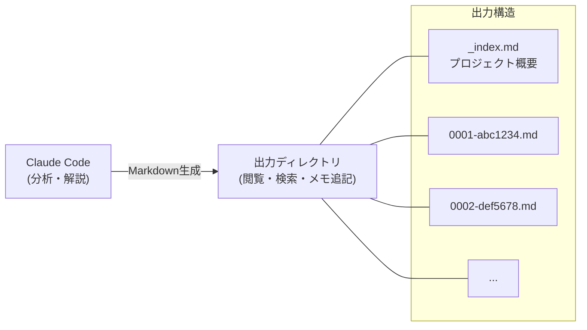

# Deep Code Reader

**OSSコードベースをコミットごとに学び、ナレッジベースを自動構築**

Claude Codeスキルによる体系的なディープコードリーディング。コミットを時系列で分析し、AIが生成したリッチなMarkdownドキュメント（Mermaid図・設計パターン解説・Q&A付き）を蓄積。読めば読むほど、検索・閲覧可能なアーキテクチャ知識ライブラリが育つ。

## クイックスタート

```
/deep-code-reader

📚 Deep Code Reader
━━━━━━━━━━━━━━━━━━━━━━━━━━━━━━

何を読みますか？

> expressを読みたい

✅ expressjs/express を設定しました
📊 総コミット数: 5,432

最初のコミットから読み始めますか？

> はい

[詳細な解説が表示される]

> なぜこのパターンを使ってるの？

[質問に回答、Q&Aに保存]

> 次

[次のコミット解説...]
```

## 特徴

- **会話型インターフェース** - コマンドを覚える必要なし
- **詳細な解説** - Mermaid図、設計パターン、Before/After比較
- **PR情報統合** - ディスカッション、レビューコメントも翻訳・解説
- **Q&A蓄積** - 質問と回答を自動保存
- **柔軟な出力先** - デフォルトはObsidian vault、任意のディレクトリに変更可能
- **セッションフック** - セッション開始時にアクティブプロジェクトを自動検出

## なぜナレッジベース？

Deep Code Reader は単にコードを解説するだけでなく、**検索可能なナレッジベースを構築**します。コミット解説はすべてMermaid図・設計パターン分析・Q&A付きのMarkdownとして保存。読み進めるほど、閲覧・検索・注釈可能なアーキテクチャ知識ライブラリが蓄積されます。


```mermaid
graph LR
    CC["Claude Code<br/>(分析・解説)"]
    OD["出力ディレクトリ<br/>(閲覧・検索・メモ追記)"]
    CC -->|"Markdown生成"| OD

    subgraph "出力構造"
        IDX["_index.md<br/>プロジェクト概要"]
        C1["0001-abc1234.md"]
        C2["0002-def5678.md"]
        C3["..."]
    end

    OD --- IDX
    OD --- C1
    OD --- C2
    OD --- C3
```

## コマンド

すべての操作は明示的なコマンドで実行します:

| コマンド | 用途 |
|---------|------|
| `/deep-code-reader` | プロジェクト初期化・再開 |
| `/deep-code-reader:next` | 次のコミットを解説 |
| `/deep-code-reader:read abc1234` | 特定のコミットを解説（hash指定） |
| `/deep-code-reader:read #298` | 特定のPRを解説（番号指定） |
| `/deep-code-reader:list` | コミット一覧を表示 |
| `/deep-code-reader:status` | 進捗確認 |

## 出力構造

```
{output_path}/
├── _index.md              # プロジェクト概要
└── commits/
    ├── 0001-abc1234.md
    ├── 0002-def5678.md
    └── ...
```

デフォルト出力先: `~/obsidian-vault/deep-code-reading/{owner}-{repo}/`

カスタム出力先:
```
/deep-code-reader expressjs/express --output ~/my-notes/express/
```

### 各解説に含まれる内容

- **基本情報** - PR番号、作成者、変更規模
- **変更の要約** - 核心コンセプト、Before/After
- **アーキテクチャ** - Mermaid図で可視化
- **コード解説** - 設計ポイント付き
- **PRやり取り** - 英語原文 + 日本語訳 + 背景解説
- **設計パターン** - 使われているパターンと原則
- **Before/After** - 改善点の比較
- **学習ポイント** - このPRから学べること

## 要件

- Claude Code CLI
- Git
- GitHub MCPサーバー（PR情報取得用）
- Obsidian（推奨）または任意のMarkdownエディタ

## インストール

### Plugin Marketplace経由（推奨）

1. **Manage Plugins**を開く（Claude Code設定）
2. **Marketplaces**タブに移動
3. `Kuroakira/deep-code-reader`を入力して**Add**をクリック
4. **Plugins**タブに切り替えて`deep-code-reader`をインストール

更新・アンインストールも同じ**Plugins**タブから。

### 手動インストール

```bash
git clone https://github.com/Kuroakira/deep-code-reader.git
cd deep-code-reader
mkdir -p ~/.claude/skills
ln -s $(pwd) ~/.claude/skills/deep-code-reader

# アンインストール:
rm ~/.claude/skills/deep-code-reader
```

## 設定

デフォルトパス:
- リポジトリ: `~/.claude/deep-code-reader/repos/`
- プロジェクト: `~/.claude/deep-code-reader/projects/`
- 出力先: `~/obsidian-vault/deep-code-reading/`（変更可能）

## ライセンス

MIT
