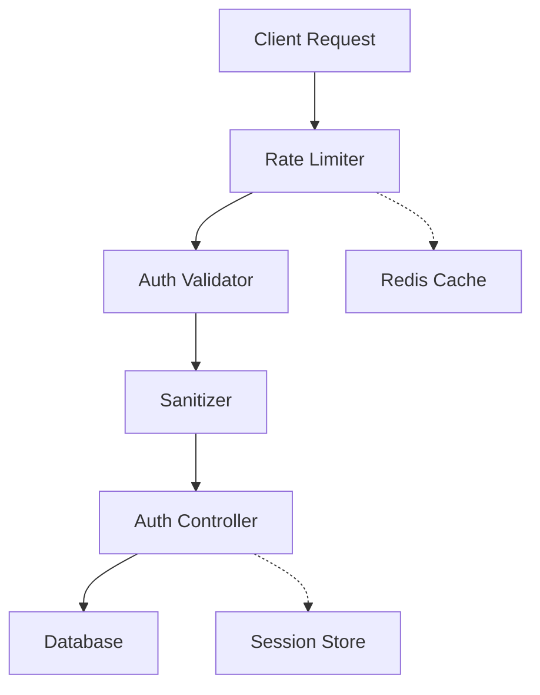

# Analyze Pull Request

Analyze all commits within a PR, understanding the collective changes and their purpose.

## Usage

```
/analyze-pr <pr-number>
/analyze-pr <pr-url>
/analyze-pr <github-url>/pull/<number>
```

**Examples**:
```
# After /register-oss - just PR number!
/analyze-pr 5234

# Or with full URL
/analyze-pr https://github.com/expressjs/express/pull/5234
/analyze-pr https://github.com/expressjs/express 5234
```

## Workflow

### Phase 0: Repository Setup and Local Clone Verification

**IMPORTANT**: This command requires a local clone for deep code analysis with Serena MCP.

#### Phase 0.1: Repository URL Resolution

```python
import os
import subprocess
from pathlib import Path

# Parse input - could be just number, full URL, or URL + number
if input_is_number_only(input):
    # Just PR number provided, read from memory
    pr_number = input
    current_oss = serena_mcp.read_memory("current_oss")

    if not current_oss:
        print("⚠️  No repository set. Please:")
        print("  1. Register: /register-oss <github-url>")
        print("  2. Or specify full URL: /analyze-pr <pr-url>")
        return

    owner = current_oss["owner"]
    repo = current_oss["repo"]
    github_url = current_oss["repo_url"]
    notion_oss_page_id = current_oss["notion_page_id"]
    commits_database_id = current_oss["commits_database_id"]
    local_repo_path = current_oss.get("local_repo_path")

    print(f"📦 Using current project: {owner}/{repo}")
else:
    # Full URL or URL + number provided
    owner, repo, pr_number = parse_pr_url(input)

    # Try to read from memory for Notion IDs and local path
    current_oss = serena_mcp.read_memory("current_oss")
    if current_oss and current_oss["repo"] == repo:
        notion_oss_page_id = current_oss.get("notion_page_id")
        commits_database_id = current_oss.get("commits_database_id")
        local_repo_path = current_oss.get("local_repo_path")
```

#### Phase 0.2: Local Clone Verification

```python
# Default location: ~/.claude/deep-code-reader/repos/{owner}/{repo}
home = Path.home()
if not local_repo_path:
    local_repo_path = home / ".claude" / "deep-code-reader" / "repos" / owner / repo

local_repo_path = Path(local_repo_path)

# Check if local clone exists
if not (local_repo_path / ".git").exists():
    print(f"❌ Error: Local clone not found at {local_repo_path}")
    print(f"")
    print(f"This repository needs to be registered and cloned first.")
    print(f"")
    print(f"Run: /register-oss {github_url}")
    print(f"")
    print(f"The register-oss command will:")
    print(f"  1. Register the repository in Notion")
    print(f"  2. Clone it to {local_repo_path}")
    print(f"  3. Enable deep code analysis with Serena MCP")
    return

print(f"✅ Local clone found: {local_repo_path}")

# Store current branch for cleanup
result = subprocess.run(
    ["git", "branch", "--show-current"],
    cwd=local_repo_path,
    capture_output=True,
    text=True
)
original_branch = result.stdout.strip() or "main"

# Fetch latest changes
subprocess.run(
    ["git", "fetch", "origin"],
    cwd=local_repo_path,
    capture_output=True,
    text=True
)
```

#### Phase 0.3: Activate Serena Project and Checkout PR

```python
# Activate project in Serena MCP for deep code analysis
serena_mcp.activate_project(str(local_repo_path))

print(f"🔍 Activating Serena MCP for deep code analysis...")
print(f"📂 Project: {local_repo_path}")
```

### Phase 1: PR Information Gathering

```python
# Get PR details from GitHub
pr_data = github_mcp.get_pull_request(
    owner=owner,
    repo=repo,
    pull_number=pr_number
)

# Get all commits in the PR
pr_commits = github_mcp.list_commits(
    owner=owner,
    repo=repo,
    sha=pr_data["head"]["sha"]  # Get commits from PR branch
)

# Get PR file changes
pr_files = github_mcp.get_pull_request_files(
    owner=owner,
    repo=repo,
    pull_number=pr_number
)

# Get PR reviews and comments
pr_reviews = github_mcp.get_pull_request_reviews(
    owner=owner,
    repo=repo,
    pull_number=pr_number
)

pr_comments = github_mcp.get_pull_request_comments(
    owner=owner,
    repo=repo,
    pull_number=pr_number
)

# Extract PR metadata
pr_info = {
    "number": pr_number,
    "title": pr_data["title"],
    "description": pr_data["body"],
    "state": pr_data["state"],
    "merged": pr_data["merged"],
    "merged_at": pr_data["merged_at"],
    "author": pr_data["user"]["login"],
    "base_branch": pr_data["base"]["ref"],
    "head_branch": pr_data["head"]["ref"],
    "head_sha": pr_data["head"]["sha"],
    "commits_count": len(pr_commits),
    "files_changed": len(pr_files),
    "additions": pr_data["additions"],
    "deletions": pr_data["deletions"],
    "labels": [label["name"] for label in pr_data["labels"]],
    "reviews": pr_reviews,
    "comments": pr_comments
}

print(f"📋 PR #{pr_number}: {pr_info['title']}")
print(f"👤 Author: {pr_info['author']}")
print(f"🔢 Commits: {pr_info['commits_count']}")
print(f"✏️ Files changed: {pr_info['files_changed']}")
print(f"📊 Lines: +{pr_info['additions']}/-{pr_info['deletions']}")
```

#### Phase 1.1: Checkout PR Branch

```python
# Checkout the PR's head branch for analysis
head_ref = f"pull/{pr_number}/head"

# Fetch the PR ref
result = subprocess.run(
    ["git", "fetch", "origin", f"pull/{pr_number}/head:{head_ref}"],
    cwd=local_repo_path,
    capture_output=True,
    text=True
)

if result.returncode != 0:
    print(f"⚠️  Warning: Could not fetch PR ref, using merge commit instead")
    # Fallback: checkout merge commit if available
    if pr_info["merged"] and pr_data.get("merge_commit_sha"):
        checkout_ref = pr_data["merge_commit_sha"]
    else:
        checkout_ref = pr_info["head_sha"]
else:
    checkout_ref = head_ref

# Checkout the PR
subprocess.run(
    ["git", "checkout", checkout_ref],
    cwd=local_repo_path,
    capture_output=True,
    text=True
)

print(f"✅ Checked out PR #{pr_number} at {checkout_ref}")
```

### Phase 2: PR-Level Analysis

Analyze the overall PR structure and collective changes:

```python
# Compare base branch with PR branch
base_ref = pr_data["base"]["sha"]
head_ref = pr_data["head"]["sha"]

# Get diff between base and head
result = subprocess.run(
    ["git", "diff", base_ref, head_ref, "--stat"],
    cwd=local_repo_path,
    capture_output=True,
    text=True
)
diff_stat = result.stdout

# Analyze overall PR purpose from title, description, and commits
pr_purpose = analyze_pr_purpose(
    title=pr_info["title"],
    description=pr_info["description"],
    commits=[c["commit"]["message"] for c in pr_commits],
    labels=pr_info["labels"]
)

print(f"🎯 PR Purpose: {pr_purpose}")
```

### Phase 3: Deep Code Analysis with Line-by-Line Reading

**IMPORTANT**: This phase provides comprehensive line-by-line analysis using Serena MCP.

#### Phase 3.1: Get Full File Contents from Local Clone

```python
# For each changed file in the PR
files_analysis = []

for file_info in pr_files:
    file_path = file_info["filename"]

    # Get file content AFTER changes (current PR state)
    try:
        file_content_after = serena_mcp.read_file(
            relative_path=file_path,
            max_answer_chars=-1  # Read entire file for deep analysis
        )
    except FileNotFoundError:
        # File was added in this PR, no "before" version
        file_content_after = serena_mcp.read_file(
            relative_path=file_path,
            max_answer_chars=-1
        )
        file_content_before = None

    # Checkout base branch to get BEFORE content
    subprocess.run(
        ["git", "checkout", base_ref, "--", file_path],
        cwd=local_repo_path,
        capture_output=True,
        text=True
    )

    try:
        file_content_before = serena_mcp.read_file(
            relative_path=file_path,
            max_answer_chars=-1
        )
    except FileNotFoundError:
        file_content_before = None  # File was added in this PR

    # Return to PR head
    subprocess.run(
        ["git", "checkout", checkout_ref, "--", file_path],
        cwd=local_repo_path,
        capture_output=True,
        text=True
    )

    # Get symbols information for the file
    symbols_info = serena_mcp.get_symbols_overview(
        relative_path=file_path,
        max_answer_chars=-1
    )

    files_analysis.append({
        "path": file_path,
        "status": file_info["status"],  # added, modified, deleted, renamed
        "additions": file_info["additions"],
        "deletions": file_info["deletions"],
        "changes": file_info["changes"],
        "content_before": file_content_before,
        "content_after": file_content_after,
        "symbols": symbols_info,
        "patch": file_info.get("patch", "")  # Diff patch
    })
```

#### Phase 3.2: Detailed File Analysis

```python
for file_data in files_analysis:
    # Analyze file's role in the codebase
    file_analysis = {
        "file_path": file_data["path"],
        "file_role": analyze_file_role(
            file_path=file_data["path"],
            symbols=file_data["symbols"],
            content=file_data["content_after"]
        ),
        "change_summary": analyze_change_summary(
            before=file_data["content_before"],
            after=file_data["content_after"],
            status=file_data["status"]
        )
    }

    file_data["analysis"] = file_analysis
```

#### Phase 3.3: Line-by-Line Code Walkthrough

```python
# For each file, provide detailed line-by-line analysis
for file_data in files_analysis:
    # Parse the patch to identify changed sections
    changed_sections = parse_patch_sections(file_data["patch"])

    code_walkthrough = []

    for section in changed_sections:
        # Analyze the specific code section
        section_analysis = {
            "line_range": section["line_range"],
            "change_type": section["type"],  # addition, deletion, modification
            "code_before": section.get("code_before"),
            "code_after": section.get("code_after"),
            "explanation": analyze_code_section(
                code=section["code_after"],
                context={
                    "file_path": file_data["path"],
                    "file_role": file_data["analysis"]["file_role"],
                    "full_content": file_data["content_after"],
                    "pr_purpose": pr_purpose,
                    "symbols": file_data["symbols"]
                }
            )
        }

        code_walkthrough.append(section_analysis)

    file_data["code_walkthrough"] = code_walkthrough
```

#### Phase 3.4: Commit-by-Commit Analysis

```python
# Analyze each individual commit in the PR
commit_analyses = []

for commit in pr_commits:
    # Checkout the specific commit
    subprocess.run(
        ["git", "checkout", commit["sha"]],
        cwd=local_repo_path,
        capture_output=True,
        text=True
    )

    # Analyze this commit using similar deep analysis
    commit_analysis = analyze_single_commit_in_pr(
        commit=commit,
        local_repo_path=local_repo_path,
        serena_mcp=serena_mcp,
        pr_context=pr_purpose
    )

    commit_analyses.append(commit_analysis)

# Return to PR head
subprocess.run(
    ["git", "checkout", checkout_ref],
    cwd=local_repo_path,
    capture_output=True,
    text=True
)
```

#### Phase 3.5: Impact Analysis with Dependency Tracking

```python
impact_analysis = {
    "modified_components": [],
    "affected_dependencies": [],
    "breaking_changes": [],
    "migration_needed": False
}

for file_data in files_analysis:
    # Find symbols that reference the changed code
    for symbol in file_data["symbols"]:
        try:
            references = serena_mcp.find_referencing_symbols(
                name_path=symbol["name_path"],
                relative_path=file_data["path"]
            )

            impact_analysis["affected_dependencies"].extend(references)
        except Exception as e:
            # Some symbols may not support reference finding
            continue

    # Check for breaking changes (signature changes, removals, etc.)
    breaking = detect_breaking_changes(
        before=file_data["content_before"],
        after=file_data["content_after"],
        symbols=file_data["symbols"]
    )

    if breaking:
        impact_analysis["breaking_changes"].extend(breaking)
        impact_analysis["migration_needed"] = True
```

#### Phase 3.6: Design Patterns and Architecture Analysis

```python
# Identify design patterns used in the PR
design_patterns = identify_design_patterns(
    files=files_analysis,
    pr_purpose=pr_purpose
)

# Architecture impact analysis
architecture_impact = analyze_architecture_impact(
    files=files_analysis,
    dependencies=impact_analysis["affected_dependencies"],
    pr_context={
        "title": pr_info["title"],
        "description": pr_info["description"],
        "commits": pr_commits
    }
)

# Create architecture diagram (Mermaid)
architecture_diagram = generate_architecture_diagram(
    files=files_analysis,
    dependencies=impact_analysis["affected_dependencies"],
    diagram_type="component"  # or "sequence", "class"
)
```

### Phase 4: Review and Comment Analysis

```python
# Analyze PR reviews
review_analysis = {
    "approval_count": 0,
    "change_request_count": 0,
    "comment_count": 0,
    "key_discussions": []
}

for review in pr_reviews:
    if review["state"] == "APPROVED":
        review_analysis["approval_count"] += 1
    elif review["state"] == "CHANGES_REQUESTED":
        review_analysis["change_request_count"] += 1

    if review.get("body"):
        review_analysis["key_discussions"].append({
            "author": review["user"]["login"],
            "comment": review["body"],
            "state": review["state"]
        })

# Analyze inline comments
for comment in pr_comments:
    review_analysis["comment_count"] += 1

    # Important discussions
    if is_important_discussion(comment):
        review_analysis["key_discussions"].append({
            "author": comment["user"]["login"],
            "file": comment.get("path"),
            "line": comment.get("line"),
            "comment": comment["body"]
        })
```

### Phase 5: Generate Comprehensive PR Summary

```python
pr_summary = {
    "metadata": pr_info,
    "purpose": pr_purpose,
    "files_changed": len(files_analysis),
    "lines_changed": {
        "additions": pr_info["additions"],
        "deletions": pr_info["deletions"]
    },
    "commits": len(pr_commits),
    "key_changes": summarize_key_changes(files_analysis),
    "technical_details": {
        "design_patterns": design_patterns,
        "architecture_impact": architecture_impact,
        "dependencies_affected": len(impact_analysis["affected_dependencies"]),
        "breaking_changes": impact_analysis["breaking_changes"]
    },
    "review_summary": review_analysis,
    "learning_points": extract_learning_points(
        files_analysis=files_analysis,
        design_patterns=design_patterns,
        pr_purpose=pr_purpose
    )
}
```

### Phase 6: Export to Notion

Export all analysis results to the Notion database with comprehensive details:

```python
# Create PR page in Notion database
notion_page = notion_mcp.create_page(
    parent={"database_id": commits_database_id},
    properties={
        "Title": {
            "title": [{"text": {"content": f"PR #{pr_number}: {pr_info['title']}"}}]
        },
        "Type": {"select": {"name": "PR"}},
        "Commit ID / PR No": {
            "rich_text": [{"text": {"content": f"#{pr_number}"}}]
        },
        "GitHub URL": {"url": f"{github_url}/pull/{pr_number}"},
        "Comment": {
            "rich_text": [{"text": {"content": pr_purpose}}]
        },
        "Analyzed Date": {"date": {"start": datetime.now().isoformat()}}
    }
)

notion_page_id = notion_page["id"]
```

#### Phase 6.1: Build Detailed Content Blocks

```python
content_blocks = []

# PR Overview
content_blocks.append({
    "heading_1": {"rich_text": [{"text": {"content": "📋 PR Overview"}}]}
})

content_blocks.append({
    "paragraph": {
        "rich_text": [{"text": {"content": f"""
**Author**: {pr_info['author']}
**Status**: {pr_info['state']} {'(Merged)' if pr_info['merged'] else ''}
**Base Branch**: {pr_info['base_branch']} → **Head Branch**: {pr_info['head_branch']}
**Commits**: {pr_info['commits_count']}
**Files Changed**: {pr_info['files_changed']}
**Lines**: +{pr_info['additions']}/-{pr_info['deletions']}
**Labels**: {', '.join(pr_info['labels']) if pr_info['labels'] else 'None'}
        """}}]
    }
})

# PR Description
if pr_info['description']:
    content_blocks.append({
        "heading_2": {"rich_text": [{"text": {"content": "📝 Description"}}]}
    })
    content_blocks.append({
        "paragraph": {
            "rich_text": [{"text": {"content": pr_info['description'][:2000]}}]
        }
    })

# PR Purpose Analysis
content_blocks.append({
    "heading_2": {"rich_text": [{"text": {"content": "🎯 Purpose"}}]}
})
content_blocks.append({
    "paragraph": {
        "rich_text": [{"text": {"content": pr_purpose}}]
    }
})

# Key Changes Summary
content_blocks.append({
    "heading_2": {"rich_text": [{"text": {"content": "🔑 Key Changes"}}]}
})

for key_change in pr_summary["key_changes"]:
    content_blocks.append({
        "bulleted_list_item": {
            "rich_text": [{"text": {"content": key_change}}]
        }
    })

# Detailed File Analysis
content_blocks.append({
    "heading_1": {"rich_text": [{"text": {"content": "📂 Detailed File Analysis"}}]}
})

for file_data in files_analysis:
    # File heading
    content_blocks.append({
        "heading_2": {"rich_text": [{"text": {"content": f"📄 {file_data['path']}"}}]}
    })

    # File role
    content_blocks.append({
        "paragraph": {
            "rich_text": [{"text": {"content": f"**File Role**: {file_data['analysis']['file_role']}"}}]
        }
    })

    # Change summary
    content_blocks.append({
        "paragraph": {
            "rich_text": [{"text": {"content": f"**Changes**: {file_data['analysis']['change_summary']}"}}]
        }
    })

    # Line-by-line code walkthrough
    if file_data.get("code_walkthrough"):
        content_blocks.append({
            "heading_3": {"rich_text": [{"text": {"content": "🔍 Detailed Change Analysis"}}]}
        })

        for i, section in enumerate(file_data["code_walkthrough"], 1):
            # Section heading
            content_blocks.append({
                "paragraph": {
                    "rich_text": [{"text": {"content": f"**Section {i}: {section['line_range']}**"}}]
                }
            })

            # Code before (if modified)
            if section.get("code_before"):
                content_blocks.append({
                    "paragraph": {
                        "rich_text": [{"text": {"content": "Code before changes:"}}]
                    }
                })
                content_blocks.append({
                    "code": {
                        "language": detect_language(file_data["path"]),
                        "rich_text": [{"text": {"content": section["code_before"][:2000]}}]
                    }
                })

            # Code after
            if section.get("code_after"):
                content_blocks.append({
                    "paragraph": {
                        "rich_text": [{"text": {"content": "Code after changes:"}}]
                    }
                })
                content_blocks.append({
                    "code": {
                        "language": detect_language(file_data["path"]),
                        "rich_text": [{"text": {"content": section["code_after"][:2000]}}]
                    }
                })

            # Detailed explanation
            content_blocks.append({
                "paragraph": {
                    "rich_text": [{"text": {"content": f"**Code Behavior Details**:\n{section['explanation']}"}}]
                }
            })

# Commit-by-Commit Breakdown
content_blocks.append({
    "heading_1": {"rich_text": [{"text": {"content": "📝 Commit-by-Commit Breakdown"}}]}
})

for commit_analysis in commit_analyses:
    content_blocks.append({
        "heading_2": {
            "rich_text": [{"text": {"content": f"Commit: {commit_analysis['sha'][:7]} - {commit_analysis['message']}"}}]
        }
    })
    content_blocks.append({
        "paragraph": {
            "rich_text": [{"text": {"content": commit_analysis["summary"]}}]
        }
    })

# Impact Analysis
content_blocks.append({
    "heading_1": {"rich_text": [{"text": {"content": "💥 Impact Analysis"}}]}
})

content_blocks.append({
    "paragraph": {
        "rich_text": [{"text": {"content": f"""
**Modified Components**: {len(impact_analysis['modified_components'])}
**Affected Dependencies**: {len(impact_analysis['affected_dependencies'])}
**Breaking Changes**: {'Yes' if impact_analysis['breaking_changes'] else 'No'}
**Migration Needed**: {'Yes' if impact_analysis['migration_needed'] else 'No'}
        """}}]
    }
})

if impact_analysis["breaking_changes"]:
    content_blocks.append({
        "heading_2": {"rich_text": [{"text": {"content": "⚠️ Breaking Changes"}}]}
    })
    for breaking in impact_analysis["breaking_changes"]:
        content_blocks.append({
            "bulleted_list_item": {
                "rich_text": [{"text": {"content": breaking}}]
            }
        })

# Design Patterns
if design_patterns:
    content_blocks.append({
        "heading_1": {"rich_text": [{"text": {"content": "🏗️ Design Patterns"}}]}
    })
    for pattern in design_patterns:
        content_blocks.append({
            "bulleted_list_item": {
                "rich_text": [{"text": {"content": pattern}}]
            }
        })

# Architecture Diagram
if architecture_diagram:
    content_blocks.append({
        "heading_1": {"rich_text": [{"text": {"content": "🏛️ Architecture Diagram"}}]}
    })
    content_blocks.append({
        "code": {
            "language": "mermaid",
            "rich_text": [{"text": {"content": architecture_diagram}}]
        }
    })

# Review Summary
content_blocks.append({
    "heading_1": {"rich_text": [{"text": {"content": "👥 Review Summary"}}]}
})

content_blocks.append({
    "paragraph": {
        "rich_text": [{"text": {"content": f"""
**Approvals**: {review_analysis['approval_count']}
**Change Requests**: {review_analysis['change_request_count']}
**Comments**: {review_analysis['comment_count']}
        """}}]
    }
})

if review_analysis["key_discussions"]:
    content_blocks.append({
        "heading_2": {"rich_text": [{"text": {"content": "💬 Key Discussions"}}]}
    })
    for discussion in review_analysis["key_discussions"][:10]:  # Limit to 10
        content_blocks.append({
            "paragraph": {
                "rich_text": [{"text": {"content": f"**{discussion['author']}**: {discussion['comment'][:500]}"}}]
            }
        })

# Learning Points
content_blocks.append({
    "heading_1": {"rich_text": [{"text": {"content": "💡 Learning Points"}}]}
})

for learning in pr_summary["learning_points"]:
    content_blocks.append({
        "bulleted_list_item": {
            "rich_text": [{"text": {"content": learning}}]
        }
    })

# Append all content blocks to the Notion page
# Note: Notion API has a limit of 100 blocks per request, so batch them
batch_size = 100
for i in range(0, len(content_blocks), batch_size):
    batch = content_blocks[i:i + batch_size]
    notion_mcp.append_block_children(
        block_id=notion_page_id,
        children=batch
    )
```

### Phase 7: Cleanup and Session End

```python
# Restore original branch
subprocess.run(
    ["git", "checkout", original_branch],
    cwd=local_repo_path,
    capture_output=True,
    text=True
)

print(f"✅ Restored to original branch: {original_branch}")

# Update analyzed PRs list
analyzed_prs = serena_mcp.read_memory("analyzed_prs") or []
if pr_number not in analyzed_prs:
    analyzed_prs.append(pr_number)
    serena_mcp.write_memory("analyzed_prs", analyzed_prs)

# Think about completion
serena_mcp.think_about_whether_you_are_done()

print(f"🎉 PR analysis complete!")
print(f"📄 Notion page: {notion_page['url']}")
```

## Output Format

### Console Output

```markdown
📦 Using current project: expressjs/express
✅ Local clone found: ~/.claude/deep-code-reader/repos/expressjs/express
🔍 Activating Serena MCP for deep code analysis...

📋 PR #5234: Security hardening for auth
👤 Author: security-team
🔢 Commits: 5
✏️ Files changed: 12
📊 Lines: +450/-120

✅ Checked out PR #5234 at pull/5234/head
🎯 PR Purpose: Enhance authentication security with input validation, rate limiting, and comprehensive test coverage

🔍 Analyzing PR-level changes...
📂 Reading file contents with Serena MCP...
🧠 Performing deep code analysis...
💥 Analyzing impact and dependencies...
🏗️ Identifying design patterns...
👥 Analyzing reviews and comments...

📝 Exporting to Notion...
✅ Created Notion page: https://notion.so/PR-5234-abc123

✅ Restored to original branch: main
🎉 PR analysis complete!

---

📄 **Notion Page**: https://notion.so/PR-5234-abc123

💡 **Next Suggestions**

Recent merged PRs from this project:

1. 🆕 #5235 - Add TypeScript definitions
   📅 Merged: 2025-01-16 • 💬 8 comments • 🔢 4 commits
   /analyze-pr 5235

2. 🆕 #5233 - Performance optimization for routing
   📅 Merged: 2025-01-14 • 💬 12 comments • 🔢 6 commits
   /analyze-pr 5233

💡 Commands:
  /list-prs              # Browse all PRs
  /list-prs --state open # See open PRs
  /list-commits          # Browse individual commits
  /current-oss           # Check current project

Continue exploring! 🚀
```

### Notion Output Format

The Notion page will contain:

```markdown
# 📋 PR Overview

**Author**: security-team
**Status**: open (Merged)
**Base Branch**: main → **Head Branch**: feature/auth-hardening
**Commits**: 5
**Files Changed**: 12
**Lines**: +450/-120
**Labels**: security, enhancement

## 📝 Description

This PR enhances the authentication system with multiple layers of security:
- Input validation for all authentication endpoints
- Rate limiting to prevent brute force attacks
- Comprehensive test coverage for security scenarios

## 🎯 Purpose

Enhance authentication security with input validation, rate limiting, and comprehensive test coverage to protect against common attack vectors including SQL injection, XSS, and brute force attacks.

## 🔑 Key Changes

- Added input sanitization middleware for authentication endpoints
- Implemented token bucket rate limiting with Redis backend
- Created comprehensive security test suite with 95% coverage
- Updated documentation with security best practices
- Fixed edge cases in session management

# 📂 Detailed File Analysis

## 📄 src/middleware/auth-validator.js

**File Role**: Middleware that validates and sanitizes input to authentication endpoints. Prevents SQL injection, XSS, and other injection attacks.

**Changes**: New file added. Implemented comprehensive input validation and sanitization functionality.

### 🔍 Detailed Change Analysis

**Section 1: L1-L45**

Code after changes:
```javascript
const validator = require('validator');
const sanitizeHtml = require('sanitize-html');

function validateAuthInput(req, res, next) {
  // L5-10: Email validation
  if (req.body.email) {
    if (!validator.isEmail(req.body.email)) {
      return res.status(400).json({ error: 'Invalid email format' });
    }
    // Sanitize and normalize to lowercase
    req.body.email = validator.normalizeEmail(req.body.email);
  }

  // L12-20: Password validation
  if (req.body.password) {
    // Length check: 8-100 characters
    if (!validator.isLength(req.body.password, { min: 8, max: 100 })) {
      return res.status(400).json({ error: 'Password must be 8-100 characters' });
    }
    // Password strength check
    if (!validator.isStrongPassword(req.body.password)) {
      return res.status(400).json({
        error: 'Password must contain uppercase, lowercase, number, and symbol'
      });
    }
  }

  next();
}
```

**Code Behavior Details**:
1. **L5-10**: Email validation and sanitization
   - `validator.isEmail()` checks RFC 5322 compliant email format
   - `normalizeEmail()` normalizes Gmail `.` and `+` tags to prevent duplicate account creation
   - Returns 400 error and stops processing if format is invalid

2. **L12-20**: Password strength validation
   - Length check prevents brute force attacks (min 8 chars) and DoS attacks (max 100 chars)
   - `isStrongPassword()` enforces combination of uppercase, lowercase, numbers, and symbols
   - Provides clear error message to encourage improvement for weak passwords

...

# 📝 Commit-by-Commit Breakdown

## Commit: abc1234 - Add input validation middleware

Implemented initial input validation middleware. Includes basic validation logic for email, password, and username.

## Commit: abc1235 - Implement rate limiting

Implemented Redis-based token bucket rate limiting. Allows up to 5 login attempts per minute per IP address to prevent brute force attacks.

...

# 💥 Impact Analysis

**Modified Components**: 3
**Affected Dependencies**: 12
**Breaking Changes**: No
**Migration Needed**: No

# 🏗️ Design Patterns

- **Chain of Responsibility**: Validates progressively through middleware chain
- **Fail Fast**: Detects validation errors early and stops processing
- **Defense in Depth**: Multiple security layers (input validation + rate limiting + session management)
- **Token Bucket**: Rate limiting algorithm handles bursty traffic

# 🏛️ Architecture Diagram



# 👥 Review Summary

**Approvals**: 3
**Change Requests**: 1 (resolved)
**Comments**: 15

## 💬 Key Discussions

**security-lead**: Excellent work on input validation. Consider adding CSP headers for additional XSS protection.

**backend-dev**: The rate limiting implementation looks solid. Should we add monitoring for rate limit violations?

**qa-engineer**: Test coverage is comprehensive. Added a few edge case scenarios in my review comments.

# 💡 Learning Points

- Input validation should happen at multiple layers (client + server) for defense in depth
- Rate limiting prevents brute force attacks but must be tuned to avoid impacting legitimate users
- Sanitization is different from validation - both are needed for comprehensive security
- Security middleware should fail fast and provide clear error messages
- Token bucket algorithm allows burst traffic while maintaining overall rate limits
- Testing security features requires thinking like an attacker (SQL injection, XSS, timing attacks)
```

## Tips

1. **Deep Code Reading**: This command uses Serena MCP for line-by-line code analysis, providing the same level of detail as manually cloning and asking Claude Code to explain each change
2. **Local Clone Required**: Repository must be registered with `/register-oss` first, which automatically clones to `~/.claude/deep-code-reader/repos/`
3. **Chronological Learning**: Use with `/list-prs` (oldest first) to understand project evolution from the beginning
4. **Comprehensive Analysis**: Each PR analysis includes:
   - Line-by-line code walkthrough with explanations
   - Symbol-level dependency tracking
   - Design pattern identification
   - Architecture diagrams
   - Impact analysis with breaking change detection
   - Review and discussion summaries
   - Learning points extraction
5. **Notion Integration**: All analysis is automatically exported to Notion with full details for future reference
6. **Multi-Commit PRs**: Analyzes each commit individually plus provides overall PR summary
7. **Review Context**: Includes PR reviews, comments, and discussions for complete context
8. **Error Handling**: If clone doesn't exist, provides clear instructions to run `/register-oss`
9. **Branch Management**: Automatically checks out PR branch and restores original branch after analysis
10. **Progress Tracking**: Marks analyzed PRs to avoid duplicates and suggest next PRs

## Error Handling

### No Local Clone

```markdown
❌ Error: Local clone not found at ~/.claude/deep-code-reader/repos/expressjs/express

This repository needs to be registered and cloned first.

Run: /register-oss https://github.com/expressjs/express

The register-oss command will:
  1. Register the repository in Notion
  2. Clone it to ~/.claude/deep-code-reader/repos/expressjs/express
  3. Enable deep code analysis with Serena MCP
```

### No Project Set

```markdown
⚠️  No repository set. Please:
  1. Register: /register-oss <github-url>
  2. Or specify full URL: /analyze-pr <pr-url>
```

### PR Not Found

```markdown
❌ Error: PR #9999 not found

Repository: expressjs/express
Status: 404 Not Found

Possible reasons:
- PR number doesn't exist
- PR was deleted
- Repository access required

Use /list-prs to browse available PRs
```

### Checkout Failed

```markdown
⚠️  Warning: Could not fetch PR ref, using merge commit instead

The PR analysis will continue using the merge commit SHA.
This may affect the accuracy of commit-by-commit analysis.
```

## Advanced Usage

### Analyze Specific PR from Different Repository

```bash
# Even if another project is registered, you can analyze any PR with full URL
/analyze-pr https://github.com/nestjs/nest/pull/1234
```

### Analyze Multiple PRs Sequentially

```bash
# Get list of oldest PRs
/list-prs --limit 10

# Analyze them in chronological order
/analyze-pr 1
/analyze-pr 2
/analyze-pr 3

# Progress tracking will mark them as analyzed (✅)
```

### Re-analyze PR with Fresh Data

```bash
# Fetch latest reviews and comments
/analyze-pr 5234

# The analysis will include all new reviews/comments since last analysis
```

## Integration with Other Commands

### Recommended Workflow for Chronological Learning

```bash
# Step 1: Register repository
/register-oss https://github.com/expressjs/express

# Step 2: List oldest PRs
/list-prs --limit 20

# Step 3: Start analyzing from PR #1
/analyze-pr 1

# Step 4: Continue chronologically
/analyze-pr 2
/analyze-pr 3

# Step 5: Check progress
/list-prs --limit 20  # ✅ marks show analyzed PRs

# Alternative: Analyze individual commits for smaller changes
/list-commits --limit 10
/analyze-commit f7c8d10
```

### Combine with Commit Analysis

```bash
# For large PRs, you might want to analyze key commits individually
/analyze-pr 5234  # Overall PR summary

# Then deep-dive into specific commits
/analyze-commit abc1234
/analyze-commit abc1235
```
