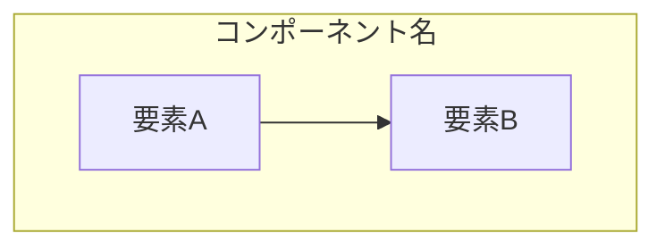
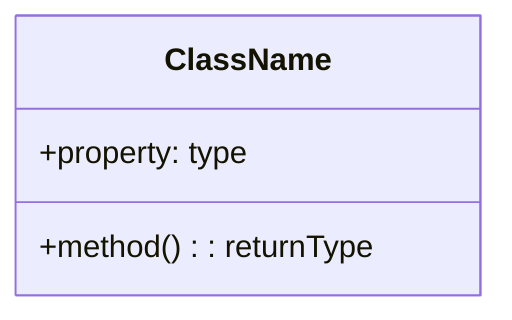
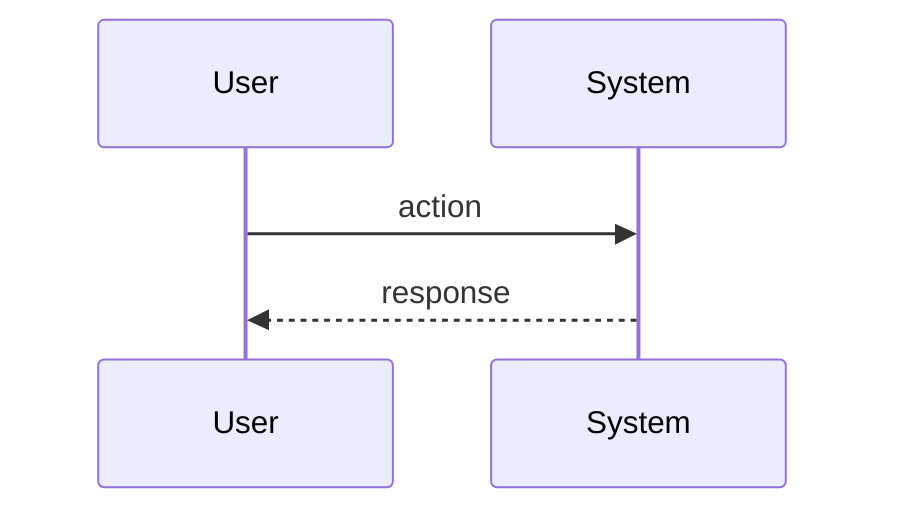
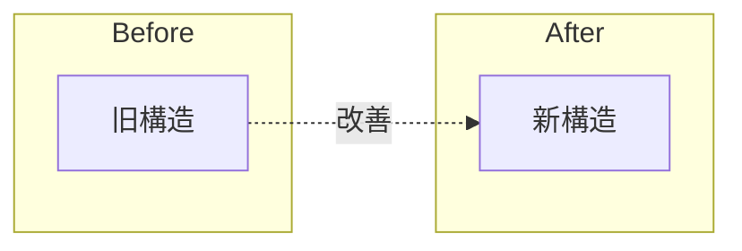

# 解説テンプレート

commit/PR解説の出力フォーマット。

## Frontmatter

```yaml
---
order: {index}
commit: {full_hash}
short_hash: {short_hash}
date: {date}
author: {author}
pr: {pr_number or null}
pr_url: {pr_url or null}
files_changed: {count}
insertions: {insertions}
deletions: {deletions}
patterns: [{detected_patterns}]
analyzed_at: {timestamp}
---
```

## 本文構造

---

## 📋 基本情報

| 項目 | 内容 |
| --- | --- |
| PR番号 | #{pr_number} または Commit: {short_hash} |
| タイトル | {title} |
| 作成者 | {author} |
| マージ日 | {date} |
| 変更規模 | +{insertions} / -{deletions} 行（{file_count}ファイル） |

---

## 🎯 変更の要約

### 核心コンセプト

{この変更の本質を1-2文で}

### 問題と解決策

**Before（従来の問題）:**
- {問題点1}
- {問題点2}

**After（この変更による解決）:**
- {解決策1}
- {解決策2}

---

## 🏗️ アーキテクチャ設計

### 全体アーキテクチャ



### クラス/インターフェース構造



### データフロー



---

## 💻 主要コード解説

### 1. {ファイル名}: {機能名}

```{language}
{コードスニペット}
```

🎓 **設計ポイント**:

1. **何をしているか**: {説明}
2. **なぜこの実装か**: {理由}
3. **パターン/テクニック**: {該当するもの}

### 2. {次のファイル}

{同様の構造}

---

## 💬 PRでのやり取り

### 会話1: {コメント者}（{トピック}）

**原文:**
> {英語コメント}

**日本語訳:**
{翻訳}

🎓 **背景解説:**
{このコメントの技術的文脈、なぜこの指摘が重要か}

### 会話2: {コメント者}

{同様の構造}

---

## 🎓 設計パターン・クリーンコード

### 使用されているパターン

| パターン | 適用箇所 | 効果 |
| --- | --- | --- |
| {Pattern Name} | {where} | {benefit} |

### 設計原則の適用

- **Single Responsibility**: {どう適用されているか}
- **Open/Closed**: {どう適用されているか}
- **DRY**: {どう適用されているか}

### 命名規則

| 名前 | 意味 | 良い点 |
| --- | --- | --- |
| {name} | {meaning} | {why good} |

---

## 🔄 Before / After 比較

### 構造の変化



### コード比較

**Before:**
```{language}
{改善前のコード}
```

**After:**
```{language}
{改善後のコード}
```

**改善点:**
- {改善点1}
- {改善点2}

---

## 📚 学習ポイント

### このPR/Commitから学べること

1. **{トピック1}**
   - {説明}
   - {適用できる場面}

2. **{トピック2}**
   - {説明}

### 関連する概念・リソース

- {関連パターン、ライブラリ、記事など}

---

## 変更ファイル一覧

| ファイル | 変更内容 | 行数 |
|---------|---------|------|
| {path} | {description} | +{ins} -{del} |

---

## 自分のメモ

<!-- ここに自分の理解やメモを追記 -->

---

## Q&A

<!-- 質問と回答を追記 -->

### Q: {質問}
A: {回答}

🎓 **補足**: {追加コンテキスト}

---

## 解説の深さの判断

### 詳細版（デフォルト）を使う場合
- 変更規模 +100行以上
- 新しいパターン/アーキテクチャ導入
- PRディスカッションが活発
- 複数ファイルにまたがる構造変更

### 簡易版を使う場合
- 小さなバグ修正（数行）
- ドキュメント更新のみ
- 依存関係更新
- フォーマット/リント修正

簡易版では以下のみ：
- 📋 基本情報
- 🎯 変更の要約（1-2文）
- 変更ファイル一覧
